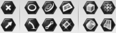

# ジオメトリパラメータ

Rhinoで作ったオブジェクトをGrasshopper上で編集するためには、アトラクターというコンポーネントを使用して、Grasshopper側にインプットする必要がある。こういった既存のRhinoオブジェクト(ジオメトリ)の受け皿となるようなコンポーネントをジオメトリパラメータという

* 右クリックでメニューを開き、Rhinoオブジェクトを選択することで、読み込むことができる。
  * Set one ~ : 1つのオブジェクトを選択
  * Set multiple ~ : 複数のオブジェクトを選択\(選択した順序がGrasshopper側にも反映\)
