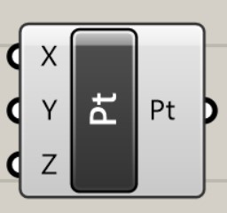

# コンポーネント

Rhinocerosでいうコマンドが格納された箱。これをつないでいくことでGrasshopperでのプログラムを作っていく。

* 左側が**入力**、右側が**出力**
* 各端子を**ドラッグで繋ぐ**ことで、コンポーネント同士を接続する

  * **ctrl + ドラッグ**：接続解除

  * **shift + ドラッグ**：複数接続

* ステータスによって色が変わる

  * **白**：通常状態

  * **オレンジ**：警告\(主に入力が足らず、うまく動いていない状態\)

  * **赤**：エラー、右上のメッセージバルーンに内容表示あり

  * **緑**：選択中

  * **灰色**：プレビューOFF、Rhino画面に表示されない
