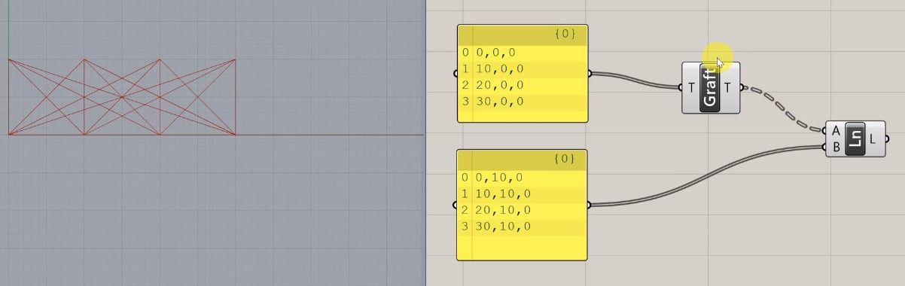

# ツリー構造

Grasshopperではコンポーネントから出力されるデータ構造を、**ツリー構造**という形式に落とし込んで整理している。

これを理解することがGrasshopper中級者～上級者への一歩。

LINEコンポーネントを用いて、複数のデータ同士の処理の違いを学んでいく。 
まずは、**基本的にGHは箱、つぎに要素を1対１対応させようとする**という原理をおぼえておこう。

### 1対多
まずは、始点(Start Point)の入力を４つ、終点(End Point)の入力を１つにしてみる。

この例では、始点、終点とも**0**という箱にそれぞれの要素が入っているので、箱の対応は無視してもよい。問題なのは、数が食い違っている要素の対応だ。
LINEは入力された始点と終点をそれぞれ結びつけようとするが、 
この場合、それぞれの入力の数が合わないため、１つの終点に、全ての始点から線が引かれる。 
このように、**１対１で相手が見つからない箱または要素は、相手側の最後の要素に紐づけられる** 

では、終点側の入力をもう一つ増やしてみる。

そうすると、最後の要素が **0,10,0**ではなく、**10,10,0**になるので、 
余った始点側の要素**20,0,0**と**30,0,0**の紐づく先が変わる。

### 1対1
では素直に始点、終点とも要素の数を同数にしてみる。 

この場合、箱と要素の数共に同数なので、GHはスムーズに1対1対応を行ってくれる。

### 多対多
１対多対応の時に使ったGHの特性を利用すれば、１対１対応だけでなく、多対多対応も可能になる。 
Graftコンポーネントを、Lineコンポーネント始点入力の手前にはさんでみる。 
すると、４つの始点と４つの終点が多対多対応に変化する。

Graftコンポーネントは、入力されたデータの要素をそれぞれ小分けの箱に詰め直す働きを持つ。 
これによって始点のデータは、１つの箱に１つの要素が格納されたセットが４つある形に変化する。 

この場合、まずは箱の対応が1対多対応になるため、**0と0;0**、**0と0;1**、**0と0;2**、**0と0;3**という箱の組み合わせができる。 
そして、本ページの冒頭で述べたとおり、箱の対応の次に要素の対応を見ていくと、こちらも1対多対応になっているため、４つの箱の組み合わせ、それぞれに４つの要素の組み合わせが発生する為、4x4で16本の線が引かれることになる。

### ツリー構造のルールまとめ
* 基本的には、箱同士、つぎに要素同士を1対１で対応する
* 相手の数が多いときは、自分の最後の要素が相手方のはみ出た要素の相手をする
* データ構造を変えるコンポーネントもある
  * **Graft：**データ階層をさらに追加する\(より枝分かれさせる\)
  * **Flatten：**複数の階層に分かれている要素を一階層にまとめる\(すべての葉を一つの枝にまとめる\)
  * **Simplify：**意味のない階層を消去する\(葉をもたない枝を消す\)
  * **Reverse：**要素の順序を入れ替える\(葉の順を入れ替える\)
* 以上の機能は各コンポーネントの端子を右クリックすることで追加することも可能
