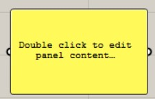
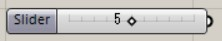
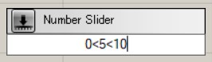

# パネルとナンバースライダー

数値を手打ちして、プログラムの反応を確かめるときに便利なのがパネルとナンバースライダー。

#### パネル

メモ帳のように数値や文字を書き込むことができ、なおかつ次のコンポーネントにパラメータを与えることもできるし、

ほかのコンポーネントの出力内容のチェックにも使える。

* 複数のデータを入れる場合は、右クリックでmultilinedataを切っておく

#### ナンバースライダー

設定した値の範囲内で、スライダーを動かして感覚的に出力する数値を変更できる。

下記のように検索ウィンドウ\(キャンバスをダブルクリックすると出現\)に書き込めば、  
上の図のナンバースライダーをつくるショートカットもある。

**最小値 &lt; 初期値 &lt; 最大値 **としてスライダーを作れる。

数値を5.00のように書き込めば、小数点以下2桁まで動かせるスライダーも作成可能。
