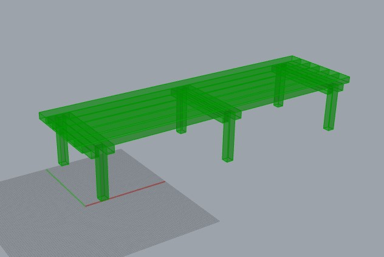
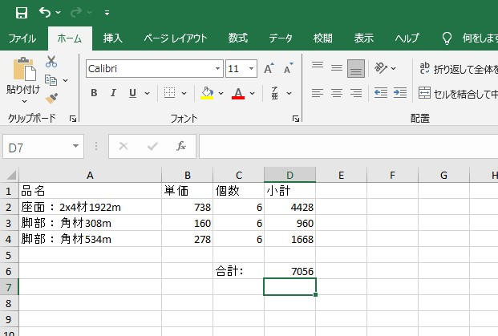

# BOMの書き出し - excelファイル出力

**BOM**とはBill Of Material (材料費リスト)の略語。 

下の画像のような、2x4材と角材で作成できるベンチのデザインをパラメトリック化し、 
希望の寸法によって形状を可変にするだけでなく、それを作成するのに必要な材料費を計算する、 
そしてそれをまとめたBOM、すなわち材料費リストをexcelファイルで出力する所までを辿ってみよう。 

下のリンクからサンプルファイルをダウンロード可能。
<a href="../assets/bench_bom.zip">ベンチGHサンプルデータ</a>
