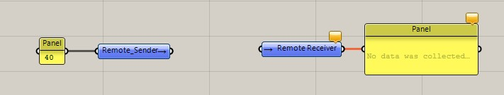
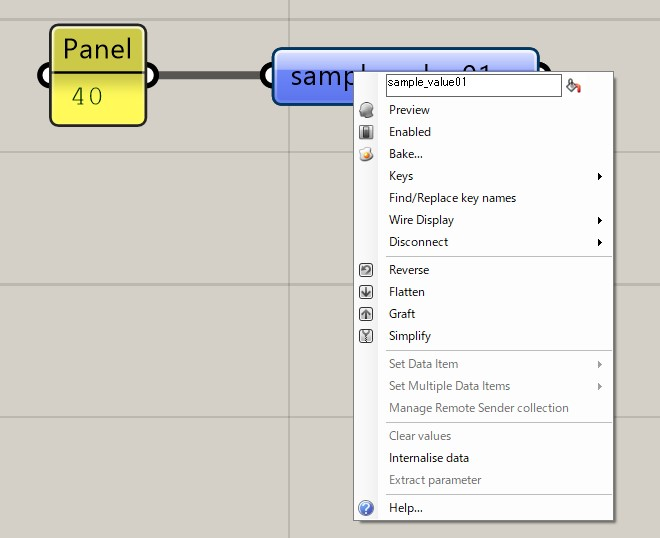
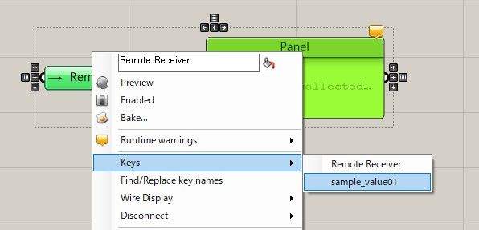
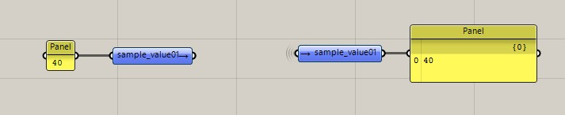
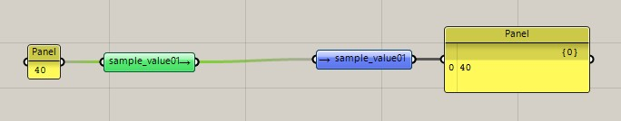

# プラグインの使い方 - Telepathy

プログラムが大きくなるにつれ、良く使うパラメータから大量のワイヤがのび、後で見返すとプログラムの流れを把握するの一苦労することは、GHユーザーの悩みの種です。 

そこで、整理整頓に役立つプラグインである**Telepathy(テレパシー)**の導入をおススメします。

### SenderとReceiverを用意する
例えば、左のパネルから右のパネルへ値を飛ばしたい、 けれども左のパネルは他多数のコンポーネントからも利用されることが分かっている時。 
直接ワイヤを繋げていくと、プログラムがワイヤでごちゃごちゃしていきます。そんな時、TelepathyのSender(送信側)を左のパネルに、Receiver(受信側)を右のパネルにつなげます。

### SenderとReceiverの名前を合わせる
次に、Senderのほうの名前を任意の名前に変更します。（ここでは"sample_value01"としました。）

Senderの方の名前を変えると、Telepathyのkeyとして登録されます。 
さっそくReceiverの方を右クリックしてkeysのリストの中から受け取りたいSenderの名前(sample_value01)を選択しましょう。

SenderとReceiverの名前が同一になると、Senderの値が見えないワイヤによってReceiverへと送られます。 
実務で使う場合は、Senderの名前を分かりやすくしておくことが、うまく使うコツです。

### コンポーネントをクリックするとワイヤが見える
Sender / Receiverコンポーネントをクリックしない限りは、二つを繋ぐワイヤは表示されないのでプログラムがグッと見やすくなります。

