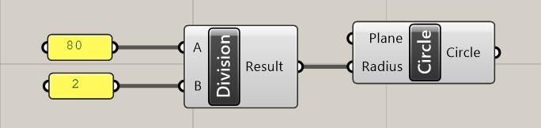
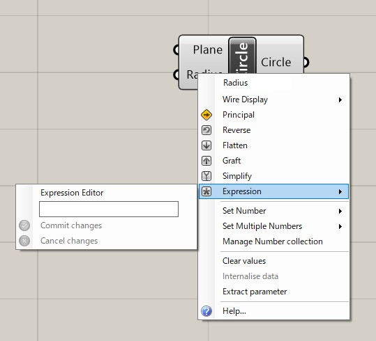
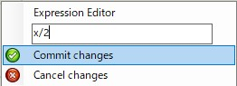
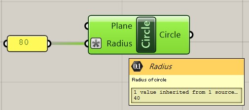

# 入力に数式をセットする

例えば、CircleコンポーネントのRadiusには、円の半径を入力しますが、どうしても直径しか手元にない場合は値をDivideコンポーネント(A/Bした値をResultに出力する)を使って直径を２で割り、Circleに渡します。

このように、本命のコンポーネントの手前で値の微調整を行うことはよくありますが、四則演算などの細かいコンポーネントの追加、ワイヤのつなぎ直しが面倒な時があります。 

そんな時は、入力端子に計算式を追加することで、コンポーネントの処理の前に値を調整することが出来ます。 

まず、計算式を追加したい入力端子(この例ではRadius)を**右クリック**、メニューから**Expression**のさらに中の**Experession Editor**ウィンドウを表示させてください。

この空欄の中に、**x/2**と入力し、**Commit changes**をクリックすると数式をセットできます。

これでRadiusに入ってきた値は２で割られた後で、Circleの半径として処理されるようになりました。

 

Expression Editorに入力されるｘは、ワイヤから流れてくる数値を表します。 
他にも、いくつか良く使う数式の例を挙げておきます↓

- 入力値から１引く：　**x-1**
- 入力値を２倍する：　**x*2**
- 入力値に１を足す：　**x+1**