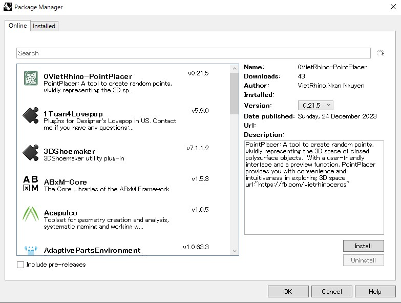
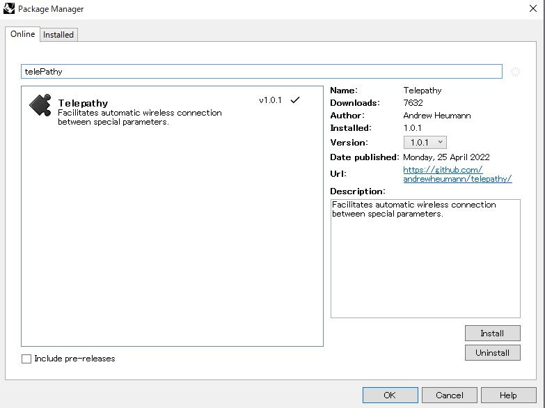

# プラグインをインストールする
GHには最初から入っているコンポーネントの他に、任意で特殊なコンポーネントを追加できるプラグインが豊富に存在します。

利用可能なプラグインの種類につては[Food4Rhino](https://www.food4rhino.com/en)などのWEBサイトで調べることが可能です。

以前は、ウェブサイトからダウンロードしたプラグインファイルを、自分でGHのフォルダに追加して機能を追加/削除する必要がありましたが、Rhino6からは**PackgageManeger**というプラグイン管理コマンドが登場したので、そういた工程がとても簡単になりました。

### PackageＭanagerを開く
まずは、Rhinoのコマンド欄に**PackageManager**と打ち込んでみましょう。 
すると以下のようなウィンドウが開きます。

**online**タブに表示されるのは、現時点で利用可能になっているプラグインの一覧。 
**installed**タブに表示されるのは、すでに自分のPCにインストール済みのプラグインの一覧です。 

### 検索してインストールする
Searchフォームに任意のキーワードを入力して、プラグインを検索してみましょう。 
ここでは、例として**Telepathy**というプラグインを探してみます。 
目当てのプラグインを見つけたら、名前をクリックして、ウィンドウ右下の**Install**ボタンをクリックすればインストールが始まります。 
インストールが完了しても、RhinoとGHを再起動しなければ、追加したコンポーネントが有効にならないので注意してください。

もし、プラグインのバージョン情報の横にチェックマークがついていたら、それはすでにインストール済だということです。